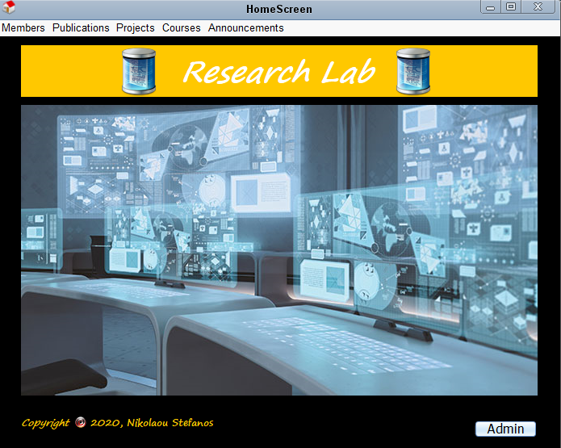
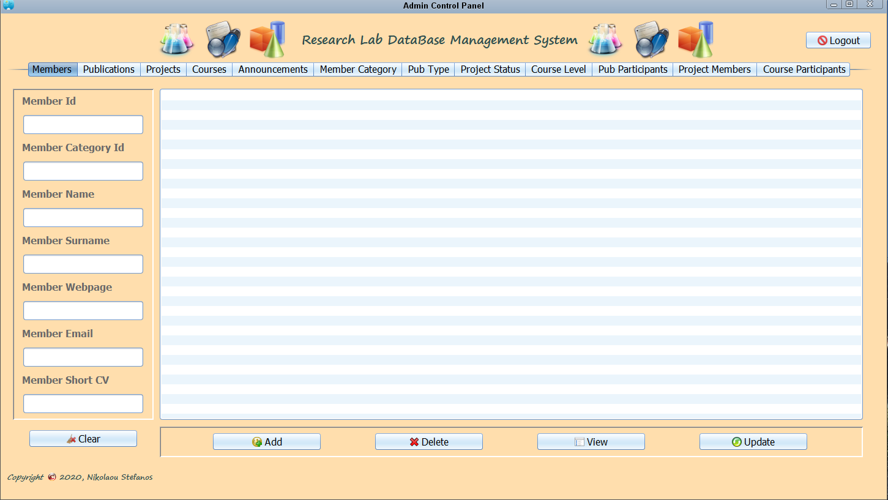

# Research-Lab-Manegement-System
The aim of this project is the design of a Relational Database, as well the development of an application that supports and presents the activities of a research lab. The application will allow the presentation of the available information to the users.
Also, through the application the system administrator will be able to manage the total of the stored information. Moreover, the administrator will have the capability of reviewing all the information and perform CRUD (Create, Read, Update, Delete) operations, through the application without the need of accessing a RDBMS (Relational Database Management System).

* Backend: Java
* Frontend: Java (Swing)
* Database: MySQL

# HomeScreen screenshot

# ControlPanel screenshot

